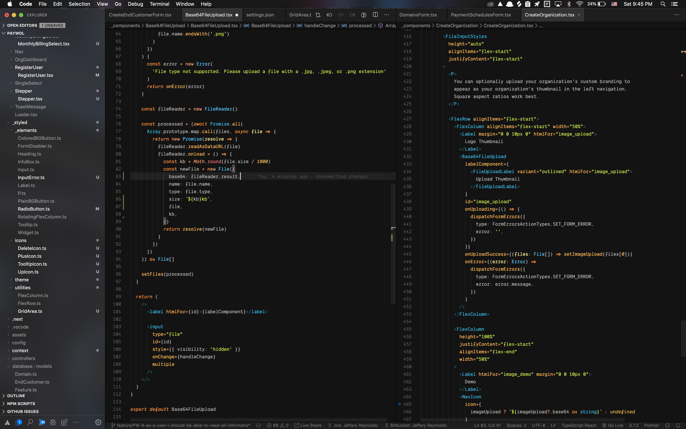
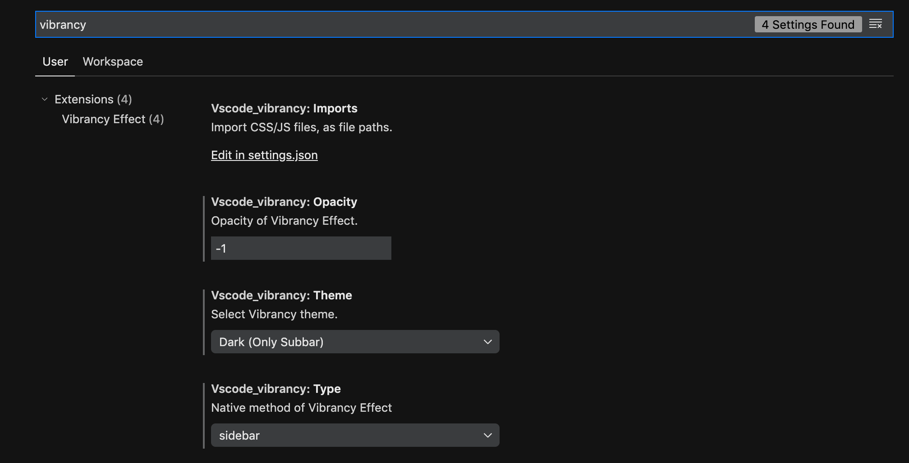

# ayu-california-dark
Bring native MacOS look and feel to Visual Studio Code



### Dependencies
It's recommended that you download NightOwl (https://nightowl.kramser.xyz/), a MacOs app that allows you to easily toggle OS Light- and Dark Modes.

You'll need to have the following VS Code extensions installed prior to installing this theme:
- Vibrancy
- Customize UI
- Auto Dark Mode

### Recommended Settings
##### Ayu California Light
A companion Light Mode theme is available at https://github.com/danallenio/vscode-ayu-california-light.
Follow the same installation instructions as below to install it. With the NightOwl app and the Auto Dark Mode
extension installed with the below recommended settings, you can easily toggle between Light- and Dark Modes:

##### Vibrancy


##### Customize UI
*settings.json*
```
...
"customizeUI.activityBar": "bottom",
"customizeUI.titleBar": "inline",
...
```


##### Auto Dark Mode
*settings.json*
```
...
"autoDarkMode.darkTheme": "Ayu California Dark",
"autoDarkMode.lightTheme": "Ayu California Light",
...
```

### Installation
Clone the repo and copy the contents to the User VS Code extensions directory in your home folder:
```
git clone https://github.com/danallenio/vscode-ayu-california-dark.git
cp -r ayu-california-dark ~/.vscode/extensions
```

Reload VS Code

Open the Preferences: Color Theme selection menu in the Command Palette (`Cmd` + `K`  `T`), and select Ayu California within the dark theme options.